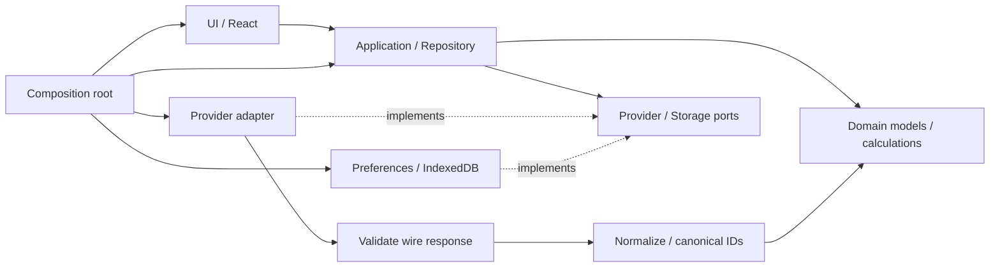

# Architecture — Phase 0

## 採用構成

React 19 / TypeScript strict / Vite 8 の静的SPAをCapacitor 8でAndroidに同梱する。React RouterのHashRouterで、Androidと静的ホスティングの両方に同じルートを使う。SSR、APIサーバー、クラウドDB、アカウント、AI依存は追加しない。

Kotlin / ComposeはAndroid専用実装が増え、ブラウザで同じUIを検証できない。Flutterも候補だが、今回のTypeScript優先とWeb開発環境を満たすために別言語・ツールチェーンを導入する利点が小さい。Next.jsのサーバー機能は現在不要。現時点ではReact + Capacitorが最小の構成。

## 依存方向

- `src/domain`: Zodで内部データ契約を定義しTypeScript型も同じ定義から生成。React / Capacitor / API固有フィールドに依存しない。
- `src/application`: Providerと保存のinterfaceを利用。取得、TTL、遅延、失敗時fallback、お気に入りの更新直列化。
- `src/infrastructure/providers`: `unknown`レスポンス → wire schema → normalization → domain validation。UIは外部のフィールド名を知らない。
- `src/infrastructure/storage.ts`: Android Preferences / Web localStorageとIndexedDBの実装。
- `src/app`: 具体的なProviderとstorageを接続。差替え箇所はここ。
- `src/ui`: Home、選手・球団検索、Player、参考Ranking、My、Capability連動Analysis Shellと共通コンポーネント。デザイントークン・Light/Darkは`styles.css`、球団/リーグの権利確認済み表示登録点は`branding.tsx`。ESLintでUIからinfrastructureへの直接importを禁止。

League / Team / Player / PlayerProfile / SeasonStats / HitterStats / PitcherStats / RecentForm / TimeWindow / MetricDefinition / Favorite / SourceMetadata / DataFreshnessを定義。RecentFormは型だけで、正式なランキング・期間集計は未実装。画面確認用の参考順位は架空カタログ内に限定する。

## IDと部分データ

内部IDをUI・route・お気に入りのキーとする。外部IDは`sourceIds`に隔離。今回の架空データは`sample:` namespaceを使い、実選手への自動移行はしない。実Provider追加時には既存の内部IDに外部IDを対応付ける表が必要。名前一致だけで同一人物とみなさない。移籍・二刀流を1つの打撃/投球レコードに押し込めない。

値は`available` / `missing` / `unsupported`を区別。0は実値。所属不明はnull。投球回はアウト数で計算し、小数としての6.1を使わない。打撃/投球を別のStatisticsとして同じ選手へ紐付ける。欠測項目、部分データ、source revisionを保持する。

## 保存とstale

| 対象 | 実装 | 寿命 / 障害時 |
|---|---|---|
| お気に入り | SettingsStore → Capacitor Preferences | Android SharedPreferences。WebはlocalStorage。アプリ削除・サイトデータ削除で消える。保存失敗をUIに通知、破損/未知versionは上書きしない |
| 取得データ | CacheStore → IndexedDB | 正規化済みcatalogをProvider×League×schema versionで保持。現在は2件のみ。全生データや履歴を蓄積しない |
| キャッシュ期限 | Provider policy | サンプルでは取得後12時間、元データ更新後7日を上限とし早い方を採用 |
| 通信 | Provider + Repository | 8秒timeout、重複取得をまとめる。自動retry連打なし。失敗時はキャッシュをstaleとして返す |

`updatedAt`（提供元の更新）、`fetchedAt`（取得）、`expiresAt`を分離。データ訂正は同一キーのsnapshotを置換し、revisionを保持。キャッシュ破損は再取得。ストレージの容量/権限エラーがあってもオンライン取得済データは表示する。

AndroidはWeb assets同梱のためネットワークなしで起動可能な構成。ブラウザは起動済みSPAでキャッシュを利用できるが、Service Workerを入れていないため**完全オフラインでの初回起動・再読込は保証しない**。IndexedDBはOSやブラウザに削除される可能性があり、唯一の原本にはしない。分析キャッシュの容量上限・削除APIは分析Repositoryを実装する際の前提条件。

## 拡張時の境界

ランキング・記録・通知などはそれぞれ必要時にapplication moduleを追加し、決定論的な計算をdomainでテストする。巨大な万能Providerや全Phase分の空フォルダーは作らない。MLB高度指標は説明定義と値を追加可能。NPBへ架空の同等指標を作らない。

Analysis追加レビュー：現在の分離で対応可能。選手catalogに投球イベントを混ぜず、別のAnalysisProvider portと集計結果契約を追加する。お気に入り・既存cacheの破壊的移行は不要。Analysis Aでは日時・Query・Capability・母数を検証し、raw event取り込みや本格分析UIは後続タスクに残す。

## コスト・公開

実行時に外部サービスは不要。追加月額0円。GitHubリモート作成・push・Vercelデプロイは未実施。Vercelは必要な場合に個人・非商用Hobby静的プレビューに限定し、上限で停止してもAndroidは影響を受けない。Cloud Functions / Cron / DBを基盤にしない。

GitHub Actionsはpublicリポジトリの標準runnerに限定。privateではjobをskipし、課金設定を確認するまでローカル`npm run check`を使う。自動課金枠や有料runnerを有効にしない。

参照：[Capacitor](https://capacitorjs.com/docs)、[環境要件](https://capacitorjs.com/docs/getting-started/environment-setup)、[Preferences](https://capacitorjs.com/docs/apis/preferences)、[Vercel Hobby](https://vercel.com/docs/plans/hobby)、[GitHub Actions billing](https://docs.github.com/en/billing/concepts/product-billing/github-actions)。確認日：2026-09-23。
